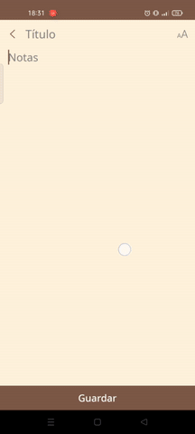

# Slide Keyboard

Android custom keyboard featuring a swipe input method.
Each key holds up to 4 different characters, which are written by swiping in the corresponding direction.
Single touch inputs the background number, and long pressing shows alternative characters for each key.

