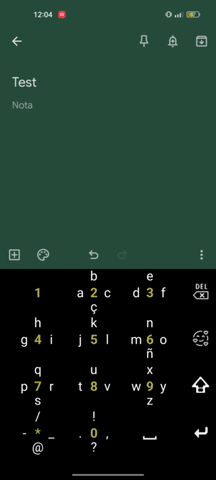
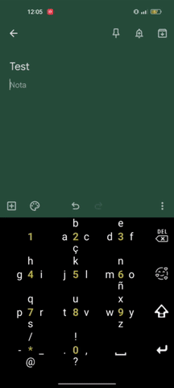

# Slide Keyboard

Android custom keyboard featuring a swipe input method, now with emoji support :heart:!

## Compact layout

Each key holds up to 4 different characters, which are inputted by swiping in the corresponding direction.
Single touch inputs the background number/character, and long pressing shows alternative characters for each key.

Swiping up or down on the shift key triggers caps!

    

## Emoji and symbols

Single pressing the shift key toggles the symbol keyboard, which works in the same way as the alphanumeric keyboard. Respectively, the emoji key now toggles the new emoji keyboard, with a selection of emoji to choose from!

    

